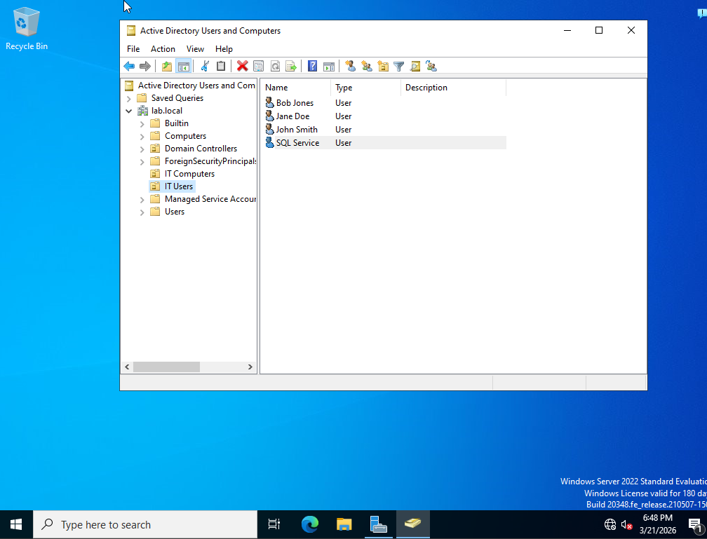
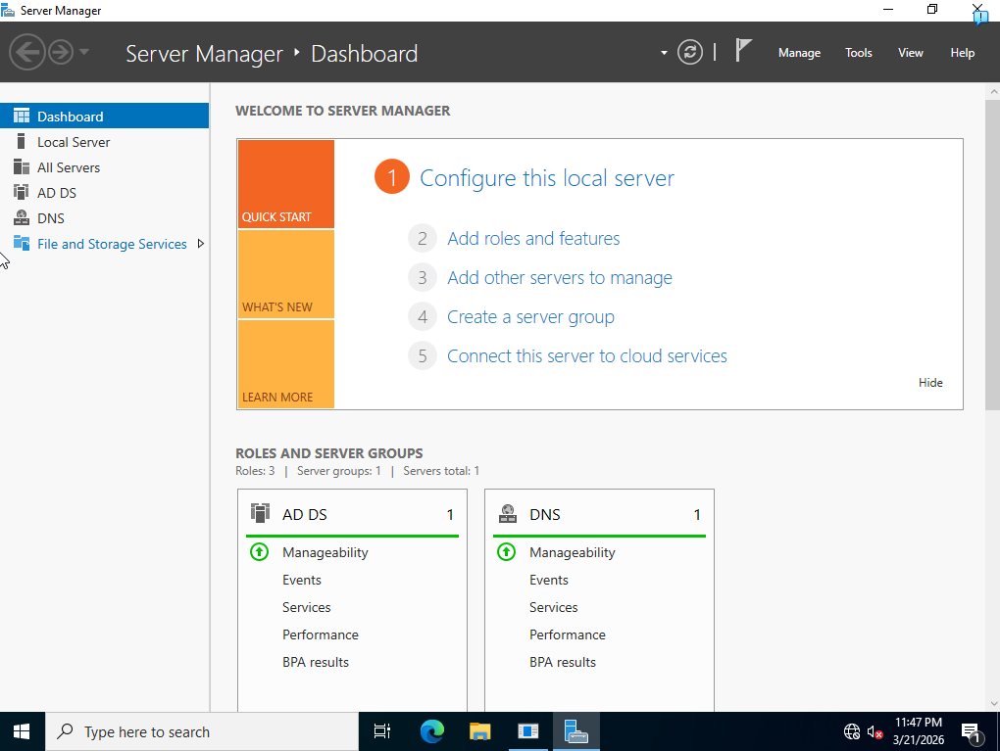
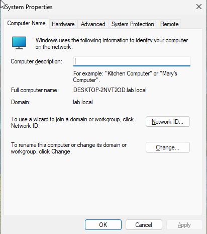
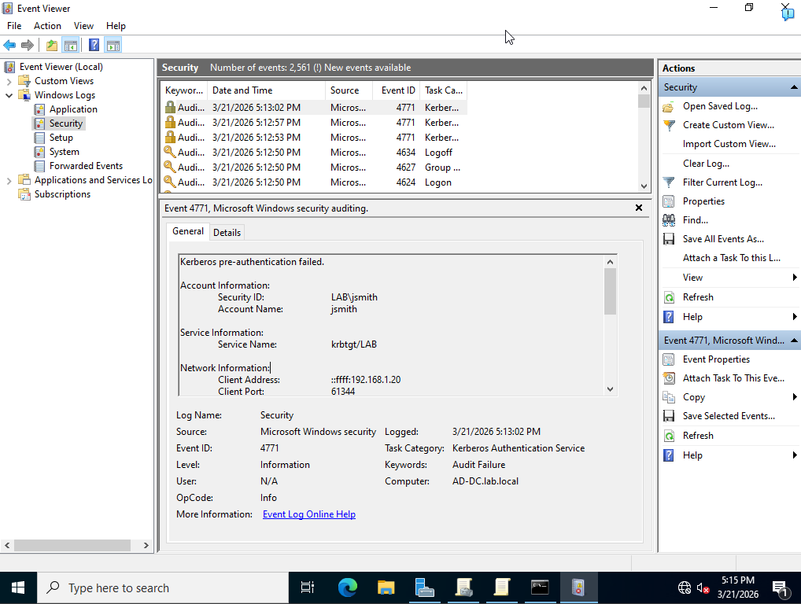
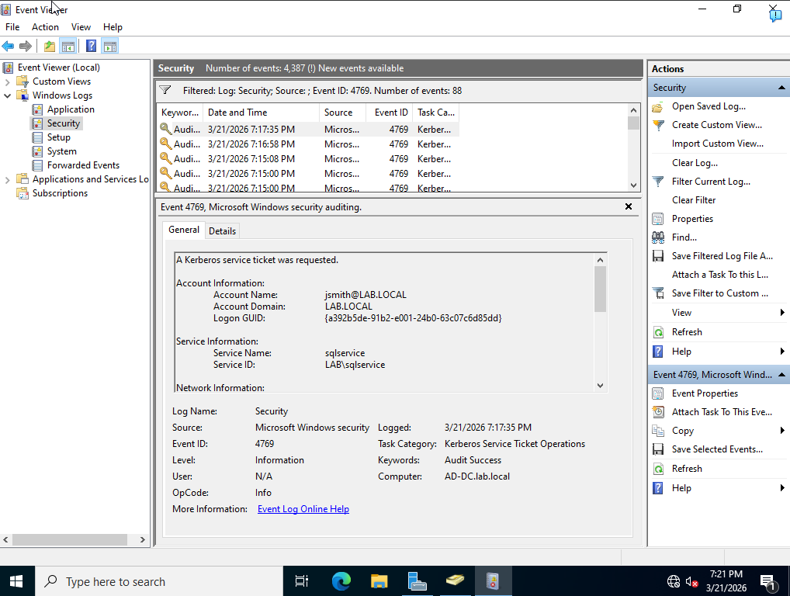
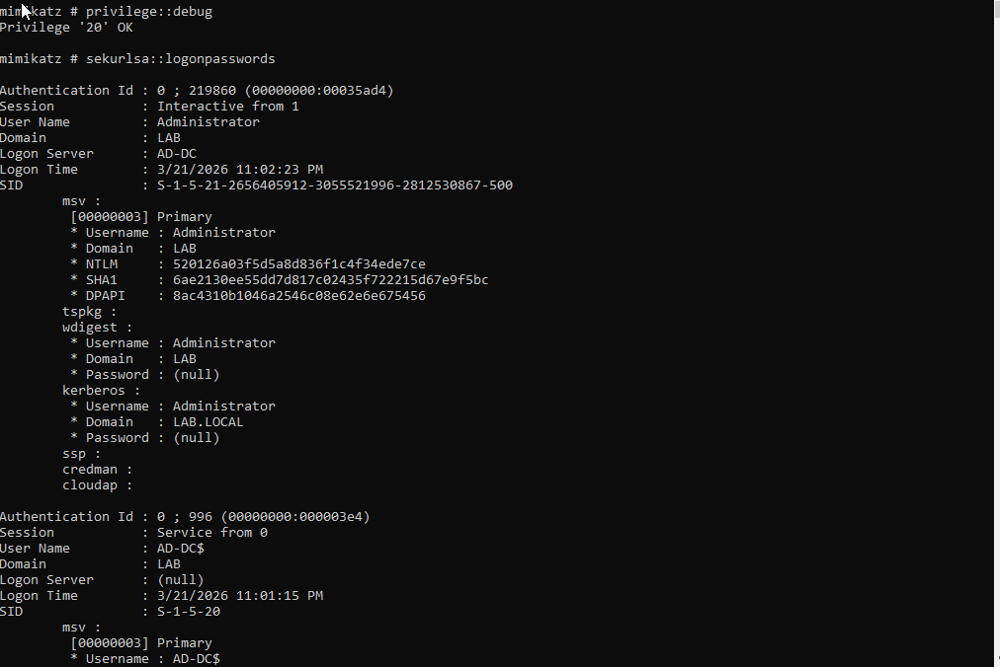
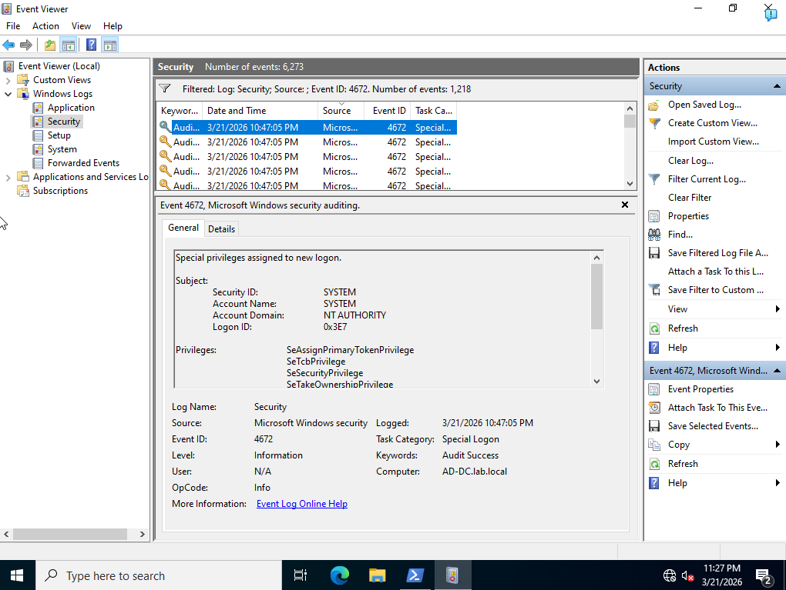

# 🏰 Active Directory Home Lab

A fully functional Active Directory home lab built with Windows Server 2022 and Windows 11, simulating a real enterprise environment. This project demonstrates building, configuring, and attacking an AD environment using real-world techniques mapped to the MITRE ATT&CK framework.

---

## 📸 Screenshots

### Active Directory Users and Computers
> *Domain structure showing lab.local domain with OUs, users, and security groups*



### Domain Controller — lab.local
> *Windows Server 2022 Domain Controller fully configured*



### Windows 11 Workstation Joined to Domain
> *Win11 workstation successfully joined to lab.local domain*



### Attack 1 — Brute Force Detection (Event ID 4771)
> *Kerberos pre-authentication failed showing brute force attempt against jsmith*



### Attack 3 — Kerberoasting Detection (Event ID 4769)
> *Kerberos service ticket requested for sqlservice account*



### Attack 4 — Credential Dumping with Mimikatz
> *Mimikatz sekurlsa::logonpasswords dumping NTLM hashes from memory*



### Event ID 4672 — Special Privileges Assigned
> *Special privileges assigned to new logon triggered by Mimikatz*



---

## 🏗️ Lab Architecture

```
┌─────────────────────────────────────────────────┐
│              VirtualBox Internal Network         │
│                   (labnetwork)                   │
│                                                  │
│  ┌─────────────────────┐  ┌──────────────────┐  │
│  │   AD-DC             │  │  Win11-Workstation│  │
│  │   Windows Server    │  │  Windows 11       │  │
│  │   2022              │  │  Enterprise       │  │
│  │   IP: 192.168.1.10  │  │  IP: 192.168.1.20 │  │
│  │                     │  │                   │  │
│  │   - Active Directory│  │  - Domain joined  │  │
│  │   - DNS Server      │  │  - lab\jsmith     │  │
│  │   - Domain: lab.local│ │  - lab\jdoe       │  │
│  └─────────────────────┘  └──────────────────┘  │
└─────────────────────────────────────────────────┘
```

---

## 🛠️ Tools & Technologies

| Tool | Version | Purpose |
|------|---------|---------|
| VirtualBox | 7.1.4 | Virtualization platform |
| Windows Server 2022 | Evaluation | Domain Controller OS |
| Windows 11 Enterprise | Evaluation | Workstation OS |
| Active Directory Domain Services | Built-in | Directory service |
| Mimikatz | 2.2.0 | Credential dumping |
| SharpHound | v2.11.0 | AD data collection |
| PowerShell | Built-in | Attack simulation |

---

## ⚙️ Lab Setup

### Domain Controller Configuration
- **Domain:** `lab.local`
- **NetBIOS:** `LAB`
- **DC Hostname:** `AD-DC`
- **IP Address:** `192.168.1.10`
- **DNS:** `127.0.0.1`

### Workstation Configuration
- **Hostname:** `Win11-Workstation`
- **IP Address:** `192.168.1.20`
- **DNS:** `192.168.1.10` (points to DC)
- **Domain:** `lab.local`

### Active Directory Structure

```
lab.local
├── IT Users (OU)
│   ├── John Smith (jsmith) — IT Admins group
│   ├── Jane Doe (jdoe)
│   ├── Bob Jones (bjones)
│   └── SQL Service (sqlservice) — Service account with SPN
├── IT Computers (OU)
└── IT Admins (Security Group)
    └── Member: jsmith
```

---

## ⚔️ Attack Simulations (MITRE ATT&CK)

### Attack 1 — Brute Force / Password Spraying
**MITRE:** T1110 — Brute Force

Simulated multiple failed login attempts against domain user `jsmith` from the Win11 workstation.

**Detection:**
- **Event ID 4771** — Kerberos Pre-authentication Failed
- Shows targeted account, source machine, and timestamp

```powershell
# Simulated from Win11 workstation login screen
# Multiple failed attempts with wrong password
Username: jsmith
Password: wrongpassword (x5)
```

---

### Attack 2 — AD Enumeration with SharpHound
**MITRE:** T1087 — Account Discovery

Ran SharpHound from the Win11 workstation to collect Active Directory data including users, groups, computers, and attack paths.

```powershell
SharpHound.exe -c All --outputdirectory C:\Tools
```

**Output:** `20260321181617_BloodHound.zip` containing AD relationship data

---

### Attack 3 — Kerberoasting
**MITRE:** T1558.003 — Steal or Forge Kerberos Tickets

Requested a Kerberos service ticket for the `sqlservice` account which has an SPN registered. The ticket can be exported and cracked offline to reveal the service account password.

**Setup on DC:**
```cmd
setspn -A MSSQLSvc/AD-DC.lab.local:1433 LAB\sqlservice
```

**Attack from Win11 Workstation:**
```powershell
Add-Type -AssemblyName System.IdentityModel
New-Object System.IdentityModel.Tokens.KerberosRequestorSecurityToken `
  -ArgumentList "MSSQLSvc/AD-DC.lab.local:1433"
```

**Detection:**
- **Event ID 4769** — Kerberos Service Ticket Requested
- Shows `sqlservice` as target, source workstation, and encryption type

---

### Attack 4 — Credential Dumping with Mimikatz
**MITRE:** T1003.001 — LSASS Memory

Used Mimikatz on the Domain Controller to dump credentials from LSASS memory, extracting NTLM hashes of all logged-in users.

```
mimikatz # privilege::debug
mimikatz # sekurlsa::logonpasswords
```

**Output:** NTLM hashes for all domain accounts currently logged in including Administrator

**Detection:**
- **Event ID 4672** — Special Privileges Assigned to New Logon
- **Event ID 4624** — Successful Account Logon

---

## 🔍 Detection Summary

| Attack | MITRE ID | Event ID | What to Look For |
|--------|----------|----------|-----------------|
| Brute Force | T1110 | 4771 | Multiple Kerberos pre-auth failures |
| AD Enumeration | T1087 | 4624 | Unusual LDAP queries |
| Kerberoasting | T1558.003 | 4769 | Service ticket requests with RC4 encryption |
| Credential Dumping | T1003.001 | 4672 | Special privileges on new logon |

---

## 🛡️ Defensive Recommendations

Based on the attacks performed, here are the key defensive measures:

- **Brute Force** — Enable account lockout policy (lock after 5 failed attempts) and implement MFA
- **Kerberoasting** — Use long complex passwords (25+ chars) for service accounts and prefer AES encryption over RC4
- **Credential Dumping** — Enable Credential Guard, restrict debug privileges, and monitor for Mimikatz signatures
- **AD Enumeration** — Implement tiered access model and monitor for unusual LDAP queries

---

## 📚 Key Learnings

- Built a fully functional enterprise-like Active Directory environment from scratch
- Learned how Kerberos authentication works and why service accounts with SPNs are vulnerable
- Understood how attackers use Mimikatz to extract credentials from memory
- Practiced the full attack lifecycle: reconnaissance → exploitation → credential access
- Mapped all attacks to MITRE ATT&CK framework techniques
- Detected attacks using Windows Security Event Logs

---

## 📁 Repository Structure

```
active-directory-lab/
├── README.md
└── screenshots/
    ├── ad-users-computers.png
    ├── domain-controller.png
    ├── domain-join.png
    ├── brute-force-detection.png
    ├── kerberoasting-detection.png
    ├── mimikatz-dump.png
    └── event-4672.png
```

---

## 🔗 References

- [MITRE ATT&CK Framework](https://attack.mitre.org)
- [Mimikatz GitHub](https://github.com/gentilkiwi/mimikatz)
- [SharpHound GitHub](https://github.com/BloodHoundAD/SharpHound)
- [Windows Security Event IDs](https://www.ultimatewindowssecurity.com/securitylog/encyclopedia/)
- [Active Directory Security](https://adsecurity.org)
- [T1110 — Brute Force](https://attack.mitre.org/techniques/T1110/)
- [T1558.003 — Kerberoasting](https://attack.mitre.org/techniques/T1558/003/)
- [T1003.001 — LSASS Memory](https://attack.mitre.org/techniques/T1003/001/)
